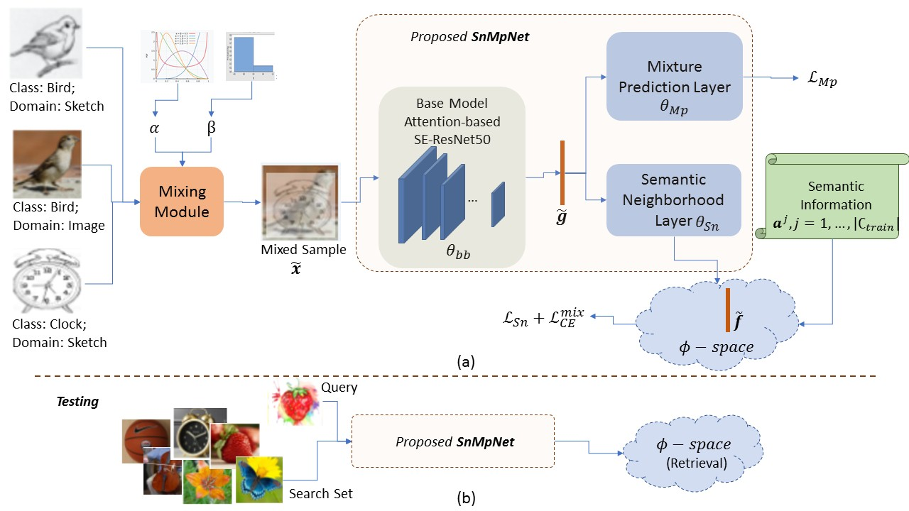

## UCDR

[http://arxiv.org/abs/2108.08356](Universal Cross-Domain Retrieval: Generalizing across Classes and Domains) | [http://iccv2021.thecvf.com/](ICCV 2021)

<p align="center">

</p>

#### Requirements and Setup

Python - 3.7.6, PyTorch - 1.1.0, CUDA - 9.0, cuDNN - 7.5.1, NVIDIA Driver Version >= 384.13

```
conda create --name torch11 --file requirements.txt
conda activate torch11
conda install pytorch==1.1.0 torchvision==0.3.0 cudatoolkit=9.0 -c pytorch
```

#### Download datasets

Check `downloads` folder for scripts. Change path_dataset in `download_sketchy.sh`.

#### Pretrained Models

Download from [here](https://drive.google.com/drive/folders/1v-ryaykcviyi7d4IdbtRZ0YuUg9L12_b?usp=sharing).

#### 🎓 Cite

If this code was helpful for your research, consider citing:

```bibtex
@article{paul2021universal,
  title={Universal Cross-Domain Retrieval: Generalizing Across Classes and Domains},
  author={Paul, Soumava and Dutta, Titir and Biswas, Soma},
  journal={arXiv preprint arXiv:2108.08356},
  year={2021}
}
```

#### 🙏 Acknowledgements

Several parts of our code have been borrowed from the following repositories:

- [https://github.com/AnjanDutta/sem-pcyc](SEM-PCYC, CVPR'19)
- [https://github.com/sounakdey/doodle2search](Doodle to Search, CVPR'19)
- [https://github.com/qliu24/SAKE](SAKE, ICCV'19)
- [https://github.com/mancinimassimiliano/CuMix](CuMix, ECCV'20)
- [https://github.com/emma-sjwang/EISNet](EISNet, ECCV'20)
